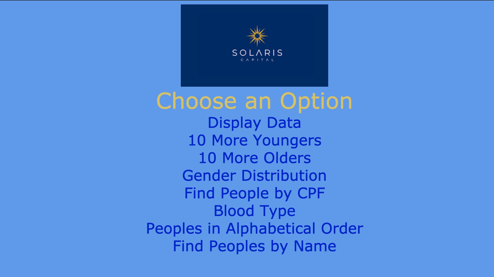

# Desafio_Tecnico-Solaris_Capital

Aplicação Web feita em Flask e Python para o processo seletivo para a vaga de  Engenheiro de Software 1 na Solaris Capital (https://www.solcap.com.br/)<br>
<br>
Para utilizar a aplicação, digite no seu terminal:
```
python solaris_challenge.py
````
No seu navegador, vá para o endereço http://127.0.0.1:5000/<br>
Lá, voce poderá escolher entre as opções:<br>
- Display Data ->  Lista os nomes de todas as pessoas no dataset
- 10 More Youngers -> Retorna uma lista das 10 pessoas mais jovens ordenadas ascendentemente, sendo possível alterar a quantidade de pessoas na própria url (por exemplo http://127.0.0.1:5000/youngers/20 irá retornar as 20 pessoas mais jovens)
- 10 More Olders -> Retorna uma lista das 10 pessoas mais velhas ordenadas ascendentemente, sendo possível alterar a quantidade de pessoas na própria url (por exemplo http://127.0.0.1:5000/olders/20 irá mostrar as 20 pessoas mais velhas)
- Gender Distribution -> Retorna um Json com a distribuição percentual de generos no dataset: Ex.: {"Feminino" 51%, "Masculino": 49%}
- Find People by CPF -> Retorna os dados de uma única pessoa em formato Json dependendo do CPF (somente números) digitado na própria url
- Blood Type -> Retorna a distribuição absoluta de grupos sanguíneos em formato Json: {"B-": 20, "O+": 10...}
- Peoples in Alphabetical Order -> Lista os nomes de todas as pessoas no dataset em ordem alfabética
- Find Peoples by Name -> Busca pessoas por nome ou por parte do nome (case insensitive)

<p align="center">

</p>

Requirements:
- Python==3.9.1
- Flask==2.0.0
- Werkzeug==2.0.1
- Pandas==1.2.4
